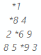
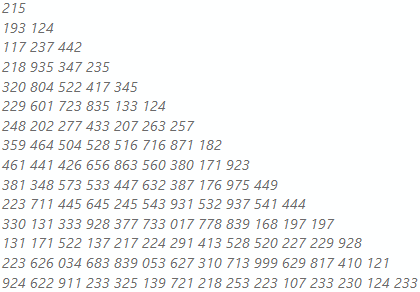

# Project-Euler-V2
This is the updated version of the Project Euler. In the previous repository <a href="https://github.com/anilcanbulut/Project-Euler-18">here</a>, I have given the algorithm that focuses on finding the maximum path in a given triangle. But in this repo, there are some other restrictions which are about prime numbers and reaching the bottom line of the triangle etc. Here what is required below:

You will have an orthogonal triangle input from a file and you need to find the maximum sum of the numbers according to given rules below;

1. You will start from the top and move downwards to an adjacent number as in below.
2. You are only allowed to walk downwards and diagonally.
3. You can only walk over NON PRIME NUMBERS.
4. You have to reach at the end of the pyramid as much as possible.
5. You have to treat your input as pyramid.

According to above rules the maximum sum of the numbers from top to bottom in below example is 24.

  

According to algorithm that you implemented what is the maximum sum of below input?

  

